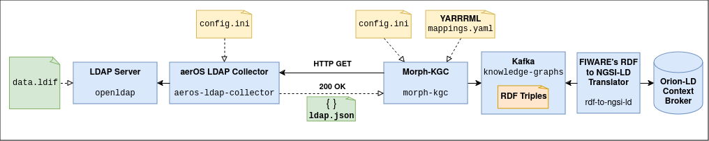

# aerOS LDAP Collector
LDAP collector based on the [`ldap3`](https://ldap3.readthedocs.io/en/latest/) Python library for the aerOS Project.

**Current version:** 1.1.3 (April 26th, 2024).

It connects to an LDAP server, retrieves information of users, roles, groups and organizations and generates a JSON object which can be used later by Morph-KGC to generate RDF triples given the appropriate mappings file. An example of this JSON output is available [here](examples/ldap.json).

The YARRRML mappings file can be found [here](examples/mappings.yaml), whereas its RML equivalent is [here](examples/mappings.ttl). The definition of these mappings is done given the aerOS Continuum Ontology definition, which diagram is included below:


The generation and retrieval of the JSON object is requested via a REST API method (`HTTP GET /ldap.json`) that the collector exposes. A sequence diagram that describes the working principle of the collector is included below:


## aerOS Data Product Pipeline for LDAP



## Building the Docker image
The collector is meant to be run as a Docker container, hence a [`Dockerfile`](Dockerfile) is provided. To build the image, simply run the following command:

```bash
$ sudo docker build -t aeros-project/ldap-collector:latest .
```

If you want to deploy the collector in a local Kubernetes cluster, you need to build and push the image to Docker's local registry.

**NOTE:** Your Kubernetes cluster must support the use of a local registry.

To enable this registry, create and/or edit the file `/etc/docker/daemon.json` with the following content:

```json
{
    "insecure-registries" : ["localhost:32000"]
}
```

After that, restart the Docker daemon:

```bash
$ sudo systemctl restart docker
```

And build and push the Docker image:

```bash
$ sudo docker build -t localhost:32000/aeros-ldap-collector:latest .
$ sudo docker push localhost:32000/aeros-ldap-collector:latest
```

**NOTE:** The HTTP server of the collector will run on port 63300 (TCP).

## Running the collector

### Configuration file
The collector is configured using an [`INI` file](https://en.wikipedia.org/wiki/INI_file).

The location (file path) where this configuration file is stored must be defined using the following environmental variable: `CONFIG_FILE_PATH`. In case this variable is not set, the application will look for the file at `/aeros-ldap-collector/conf/config.ini`.

An example file is available [here](conf/config.ini), although the structure of the file is the following:

```ini
; Configuration file for aerOS LDAP Collector.

; Default configuration directives:
[DEFAULT]
; No default directives are used as of now.

; (MANDATORY) General directives for the LDAP database:
[ldap.general]
; (MANDATORY) organization_dn (String): DN of the organization which information is to be retrieved.
organization_dn = <value>

; (MANDATORY) Directives for establishing a connection with the LDAP server:
[ldap.connection]
; (MANDATORY) server_endpoint (String): URI where the server is listening for incoming connections or requests.
; FORMAT: ldap(s)://<ip_or_fqdn>:<port>
; LDAP (unencrypted) port is 389. LDAPS (encrypted) port is 636.
server_endpoint = <value>

; (MANDATORY) use_ssl (Boolean): defines whether or not to use SSL for the connection with the server.
; Valid values are True or False.
use_ssl = <value>

; (MANDATORY) user (String): defines the DN of the LDAP user for connecting and retrieving information.
user = <value>

; (MANDATORY) password (String): password of the LDAP user defined above.
password = <value>

; (MANDATORY) max_retries (Integer): defines the maximum number of times the client will try to establish
; a connection with the server.
max_retries = <value>

; (MANDATORY) timeout (Integer): defines the time (in seconds) to wait between retries while trying to establish
; a connection with the server.
timeout = <value>
```

### Docker Compose
If you choose to deploy the collector using Docker Compose, you can define the service using the following directives:

```yaml
aeros-ldap-collector:
    image: aeros-project/ldap-collector:latest
    hostname: aeros-ldap-collector
    container_name: aeros-ldap-collector
    ports:
        - "63300:63300"
    environment:
        - CONFIG_FILE_PATH=/aeros-ldap-collector/conf/config.ini
    volumes:
        - ./aeros-ldap-collector/conf:/aeros-ldap-collector/conf
```

You can change the configuration directives by modifying the [configuration file](conf/config.ini).

### Standalone Kubernetes
A basic/standalone Kubernetes descriptor file is provided.
This descriptor can be located [here](kubernetes/standalone/aeros-ldap-collector.yaml). You can edit this file and change the configuration directives for the collector as well as the file path where they will be mounted.

For deploying the collector, run the following command at the `./kubernetes/standalone` directory:

```bash
$ kubectl apply -f aeros-ldap-collector.yaml
```

For deleting the deployment, run the following command, also at the `./kubernetes/standalone` directory:

```bash
$ kubectl delete -f aeros-ldap-collector.yaml
```

### Helm Chart
A Helm Chart is also provided. You can find all files and descriptors [here](kubernetes/helm/).
Should you need to change the configuration directives for the collector, simply edit the [ConfigMap descriptor file](kubernetes/helm/templates/configmap.yaml). You can also modify the [`values.yaml`](kubernetes/helm/values.yaml) file if you need it.

To install the Helm Chart, run the following command at the `./kubernetes` directory:

```bash
$ helm install aeros-ldap-collector ./helm
```

To uninstall the Helm Chart, run the following command:

```bash
$ helm uninstall aeros-ldap-collector
```

## Running the data product pipeline testbed

In the [`data-product-pipeline-testbed`](data-product-pipeline-testbed) subdirectory you can find a Docker Compose scenario that defines a testbed with a _data product pipeline_ for testing the LDAP Collector as well as the integration of LDAP data into the knowledge graph.

To deploy the scenario, navigate to that subdirectory and run the following command:

```bash
$ sudo docker compose up
```

The pipeline will run once, and the LDAP data will be included into the knowledge graph. You can query the NGSI-LD Context Broker with the following commands (make sure you have the `jq` package installed in your machine so that the JSON output can be properly formatted and thus be easier to read):

- __To get all `User` entities__:

```bash
$ curl -X GET "http://localhost:1026/ngsi-ld/v1/entities?type=User" -H  "accept: application/json" | jq
```

- __To get all `Role` entities__:

```bash
$ curl -X GET "http://localhost:1026/ngsi-ld/v1/entities?type=Role" -H  "accept: application/json" | jq
```

- __To get all `Organization` entities__:

```bash
$ curl -X GET "http://localhost:1026/ngsi-ld/v1/entities?type=Organization" -H  "accept: application/json" | jq
```

- __To get all `Membership` entities__:

```bash
$ curl -X GET "http://localhost:1026/ngsi-ld/v1/entities?type=Membership" -H  "accept: application/json" | jq
```

To destroy the scenario, run the following command:

```bash
$ sudo docker compose down
```
