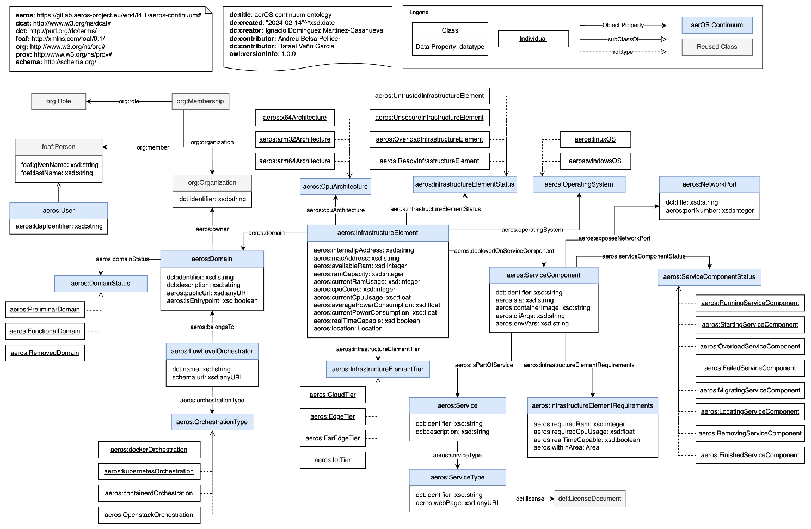
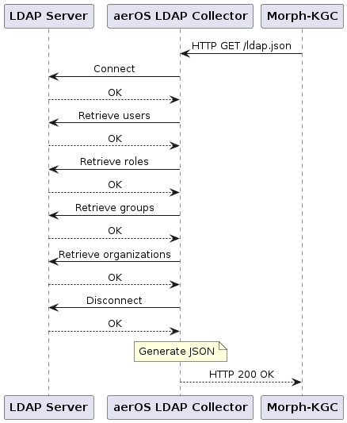
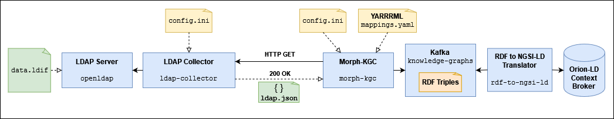

# LDAP Collector

The LDAP collector is a Python application based on the [`ldap3`](https://ldap3.readthedocs.io/en/latest/), [FastAPI](https://fastapi.tiangolo.com/) and [Uvicorn](https://www.uvicorn.org/) libraries.

It connects to an LDAP server, retrieves information of users, roles, groups and organizations and generates a JSON object which can be used later by Morph-KGC to generate RDF triples given the appropriate mappings file. An example of this JSON output is available [here](examples/ldap.json).

The YARRRML mappings file can be found [here](examples/mappings.yaml), whereas its RML equivalent is [here](examples/mappings.ttl). These mappings have been defined according to the aerOS Continuum Ontology, which diagram is included below:



The LDAP collector is a neccesary component for integrating LDAP data into the knowledge graph.

The generation and retrieval of the JSON object is requested via a REST API method (`HTTP GET /ldap.json`) that the collector exposes. A sequence diagram that describes the working principle of the collector is included below:



## Current versions:
- **LDAP Collector application**: 1.1.3 (April 26th, 2024).
- **Dockerfile**: 2.0.0 (June 3rd, 2024).
- **Kubernetes manifest file**: 2.0.1 (June 3rd, 2024).
- **Helm Chart**: 2.0.1 (June 3rd, 2024).

## Data Product Pipeline for LDAP



## Building the Docker image
The collector is meant to be run as a Docker container, hence a [`Dockerfile`](Dockerfile) is provided. To build the image, simply run the following command:

```bash
$ sudo docker build -t candil-data-fabric/ldap-collector:2.0.0 .
```

**NOTE:** The collector will serve HTTP GET requests on port 63300 (TCP).

If you want to deploy the collector in a local Kubernetes cluster, you need to build and push the image to Docker's local registry.

**NOTE:** Your Kubernetes cluster must support the use of a local registry.

To enable this registry, create and/or edit the file `/etc/docker/daemon.json` with the following content:

```json
{
    "insecure-registries" : ["localhost:32000"]
}
```

After that, restart the Docker daemon:

```bash
$ sudo systemctl restart docker
```

And build and push the Docker image:

```bash
$ sudo docker build -t localhost:32000/ldap-collector:2.0.0 .
$ sudo docker push localhost:32000/ldap-collector:2.0.0
```

## Running the collector

### Configuration file
The collector is configured using an [`INI` file](https://en.wikipedia.org/wiki/INI_file).

The location (file path) where this configuration file is stored must be defined using the following environmental variable: `CONFIG_FILE_PATH`. In case this variable is not set, the application will look for the file at `/ldap-collector/conf/config.ini`.

An example file is available [here](conf/config.ini), although the structure of the file is the following:

```ini
; LDAP Collector - Configuration file.

; Default configuration directives:
[DEFAULT]
; No default directives are used as of now.

; (MANDATORY) General directives for the LDAP database:
[ldap.general]
; (MANDATORY) organization_dn (String): DN of the organization which information is to be retrieved.
organization_dn = <value>

; (MANDATORY) Directives for establishing a connection with the LDAP server:
[ldap.connection]
; (MANDATORY) server_endpoint (String): URI where the server is listening for incoming connections or requests.
; FORMAT: ldap(s)://<ip_or_fqdn>:<port>
; LDAP (unencrypted) port is 389. LDAPS (encrypted) port is 636.
server_endpoint = <value>

; (MANDATORY) use_ssl (Boolean): defines whether or not to use SSL for the connection with the server.
; Valid values are True or False.
use_ssl = <value>

; (MANDATORY) user (String): defines the DN of the LDAP user for connecting and retrieving information.
user = <value>

; (MANDATORY) password (String): password of the LDAP user defined above.
password = <value>

; (MANDATORY) max_retries (Integer): defines the maximum number of times the client will try to establish
; a connection with the server.
max_retries = <value>

; (MANDATORY) timeout (Integer): defines the time (in seconds) to wait between retries while trying to establish
; a connection with the server.
timeout = <value>
```

### Docker Compose
If you choose to deploy the collector using Docker Compose, you can define the service using the following directives:

```yaml
ldap-collector:
    image: candil-data-fabric/ldap-collector:2.0.0
    hostname: ldap-collector
    container_name: ldap-collector
    ports:
        - "63300:63300"
    environment:
        - CONFIG_FILE_PATH=/ldap-collector/conf/config.ini
    volumes:
        - ./ldap-collector/conf:/ldap-collector/conf
```

You can change the configuration directives by modifying the [configuration file](conf/config.ini).

### Kubernetes manifest file

Should you need to change the configuration directives for the collector, simply edit the [`ConfigMap` defined in the manifest file](kubernetes/ldap-collector.yaml).

To deploy the collector, run the following command at the `./kubernetes` directory:

```bash
$ kubectl apply -f ldap-collector.yaml
```

To delete the deployment, run the following command, also at the `./kubernetes` directory:

```bash
$ kubectl delete -f ldap-collector.yaml
```

### Helm Chart

Should you need to change the configuration directives for the collector, simply edit the [`ConfigMap` descriptor file](helm/templates/configmap.yaml). You can also modify the [`values.yaml`](helm/values.yaml) and [`Chart.yaml`](helm/Chart.yaml) files if you need it.

To install the Helm Chart, run the following command at the `./kubernetes` directory:

```bash
$ helm install ldap-collector ./helm
```

To uninstall the Helm Chart, run the following command:

```bash
$ helm uninstall ldap-collector
```

## Running the data product pipeline testbed

In the [`data-product-pipeline-testbed`](data-product-pipeline-testbed) subdirectory you can find a Docker Compose scenario that defines a testbed with a _data product pipeline_ for testing the LDAP Collector as well as the integration of LDAP data into the knowledge graph.

Go [here](data-product-pipeline-testbed/README.md) to get instructions on how to run and interact with the testbed.
