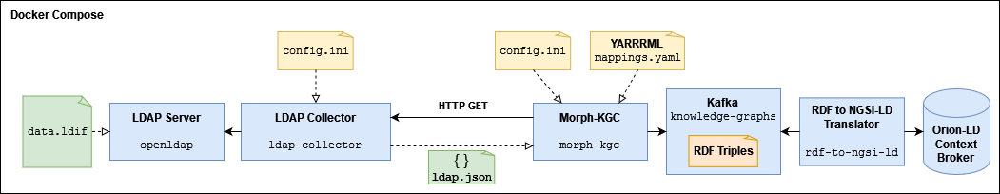
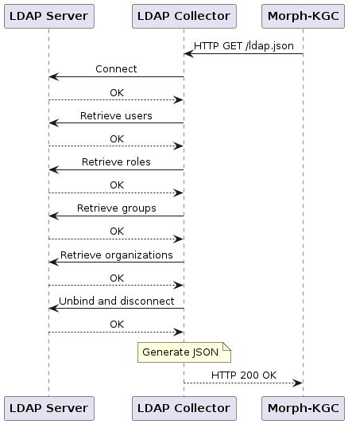

# Data Product Pipeline testbed for LDAP






To deploy the scenario run the following command:

```bash
$ sudo docker compose up
```

The pipeline will run once, and the LDAP data will be included into the knowledge graph. You can query the NGSI-LD Context Broker with the following commands (make sure you have the `jq` package installed in your machine so that the JSON output can be properly formatted and thus be easier to read):

- __To get all `User` entities__:

```bash
$ curl -X GET "http://localhost:1026/ngsi-ld/v1/entities?type=User" -H  "accept: application/json" | jq
```

- __To get all `Role` entities__:

```bash
$ curl -X GET "http://localhost:1026/ngsi-ld/v1/entities?type=Role" -H  "accept: application/json" | jq
```

- __To get all `Organization` entities__:

```bash
$ curl -X GET "http://localhost:1026/ngsi-ld/v1/entities?type=Organization" -H  "accept: application/json" | jq
```

- __To get all `Membership` entities__:

```bash
$ curl -X GET "http://localhost:1026/ngsi-ld/v1/entities?type=Membership" -H  "accept: application/json" | jq
```

If you wish to browse the LDAP database, you can open the `phpldapadmin` GUI at https://localhost:6443. To log in, enter the following credentials:
- User/Admin DN: `cn=admin,dc=mycompany,dc=com`
- Password: `candil`

To destroy the scenario, run the following command:

```bash
$ sudo docker compose down
```
